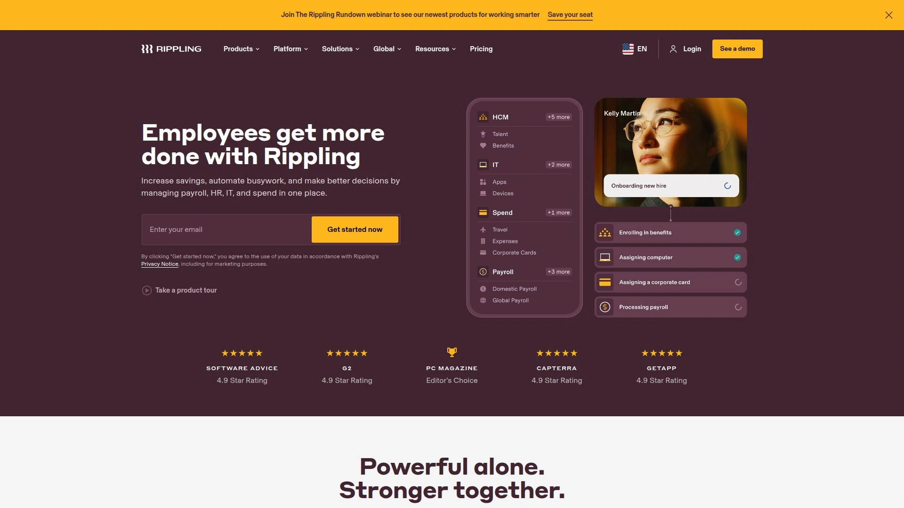

# Top 10 Best Global HR Platforms in 2025

Tired of the headaches that come with hiring talent across borders? Navigating international payroll, taxes, and compliance can feel like a full-time job. These global HR platforms are designed to handle the heavy lifting, letting you hire the best person for the job, no matter where they live, without needing to become a global legal expert overnight.

## **[Remote](https://remote.com)**

Remote offers a top-tier global HR solution that simplifies payroll, benefits, taxes, and compliance for distributed teams, making international hiring feel almost as easy as hiring next door.

It acts as an Employer of Record (EOR), which means it legally employs workers on your behalf in other countries, removing the need for you to set up your own local entities. This is a game-changer for companies looking to expand their talent pool globally without getting tangled in foreign legal systems. The platform handles employment contracts, ensures compliance with local labor laws, and automates payroll in local currencies.

**Key Features:**
* **Global Payroll and Compliance:** Automates international payroll processing and ensures adherence to local tax and labor laws.
* **Benefits Management:** Provides competitive benefits packages tailored to the standards of each country, helping you attract and retain top talent.
* **IP and Invention Rights:** Offers robust protection for your company's intellectual property, securing it through its localized legal infrastructure.

## **[Rippling](https://www.rippling.com)**

Rippling stands out by unifying HR, IT, and Finance into a single, modern platform, making it ideal for fast-moving companies that want to automate their global operations from end to end.

This platform goes beyond standard HR tasks by also managing employee apps and devices, which is a huge plus for remote-first companies. With its native global payroll and EOR services, Rippling allows you to hire and pay workers in different countries seamlessly. Its strength lies in its automation capabilities, which streamline everything from onboarding to offboarding, freeing up your team to focus on more strategic work.

## **[Deel](https://www.deel.com)**

Deel is a powerhouse in global workforce management, built to handle everything from direct employees to international contractors under one roof, with support for over 150 countries.

The platform is incredibly flexible, allowing you to hire full-time employees through its EOR service or manage contractors while minimizing misclassification risks. Deel shines with its automated HR workflows, customized onboarding processes based on country, and powerful integrations that connect with your existing tech stack. It provides a truly comprehensive solution for businesses that need to manage a diverse, global team efficiently.

## **[Oyster HR](https://oysterhr.com)**

Oyster is a global employment platform designed to make hiring talent from anywhere in the world a smooth and compliant process, with a strong emphasis on a great user experience.

It provides EOR services, cross-border payroll, and localized benefits administration, all accessible through an intuitive and easy-to-navigate platform. Oyster is particularly useful for companies that are new to global hiring and want a solution that guides them through the complexities of international employment. The platform’s focus on analytics also gives you valuable insights into your distributed team.

## **[Globalization Partners](https://www.globalization-partners.com)**

Globalization Partners offers a leading global employment platform powered by AI, designed to help companies hire talent in over 180 countries without setting up international branch offices.

This platform is an excellent choice for businesses looking for extensive global coverage and robust compliance support. It handles the entire lifecycle of global team members, from hiring and onboarding to payroll and offboarding. By acting as the EOR, Globalization Partners assumes the responsibility for navigating complex international labor laws and tax regulations, enabling you to expand your team with confidence.

## **[Velocity Global](https://velocityglobal.com)**

Velocity Global provides comprehensive workforce solutions, including EOR services, designed to facilitate seamless global expansion for businesses of all sizes.

The platform offers deep expertise in navigating the legal and logistical challenges of international hiring. It enables companies to quickly and compliantly onboard employees in new markets. Velocity Global's approach is to provide a high-touch service, ensuring that both the employer and the employee have a smooth experience throughout the employment lifecycle, from contract generation to payroll processing.

## **[Papaya Global](https://www.papayaglobal.com)**

Papaya Global is an automated platform that streamlines global payroll and workforce management, using AI to ensure compliance and efficiency across more than 160 countries.

It’s designed to give you full visibility into your global spending and workforce data through a single, unified system. Papaya Global can handle all types of workers, including full-time employees, contractors, and payroll employees. Its powerful analytics and reporting tools make it easier for companies to make data-driven decisions about their international workforce.

## **[Safeguard Global](https://safeguardglobal.com)**

Safeguard Global specializes in global payroll and workforce management, helping companies expand internationally while ensuring compliance and efficiency.

This platform is particularly well-suited for businesses that need a reliable solution for managing payroll across multiple countries. It adapts to the complexities of local regulations and changing labor laws, reducing risk and administrative burden. Safeguard Global's services are designed to scale with your business as you grow your global presence.

## **[Remofirst](https://www.remofirst.com)**

Remofirst provides an affordable and efficient EOR service aimed at startups and growing companies that want to hire talent globally without breaking the bank.

The platform offers a simple, flat-pricing structure, making it easy to manage costs as you scale your team. Remofirst takes care of international payroll, benefits, taxes, and compliance, allowing you to focus on finding and managing the right people for your team. It’s a great option for businesses that need a straightforward, cost-effective solution for global employment.

## **[Multiplier](https://multiplier.com)**

Multiplier is a global employment platform that helps businesses hire and pay international team members compliantly, with a strong focus on providing comprehensive employee benefits.

The platform allows you to generate employment contracts, manage payroll, and offer localized benefits in minutes. Multiplier acts as the legal employer, handling all the complex HR and compliance tasks associated with hiring abroad. This enables you to tap into a global talent pool and build a distributed team quickly and easily.

### FAQ Common Questions

**How do you choose the right global HR platform for a small business?**
For small businesses, focus on platforms with transparent, scalable pricing and a user-friendly interface. Prioritize solutions that offer strong EOR services to minimize legal risks without requiring a large upfront investment.

**What's the difference between an Employer of Record (EOR) and managing your own entity?**
An EOR legally hires employees on your behalf in another country, handling all payroll, tax, and compliance issues. Managing your own entity means you have to set up a local company, which is a complex, expensive, and time-consuming process.

**How quickly can you onboard an international employee using these platforms?**
Most of these platforms can help you onboard a new international employee in a matter of days. They handle the contract generation, compliance checks, and initial payroll setup, dramatically speeding up a process that could otherwise take months.

### Conclusion

Choosing the right platform can turn the daunting task of global expansion into a strategic advantage. These tools remove the friction from international hiring, payroll, and compliance, letting you build the best team possible, no matter the distance. For companies that prioritize a simple, secure, and all-in-one solution, **[Remote](https://remote.com)** is an outstanding choice for managing a distributed workforce with confidence.
